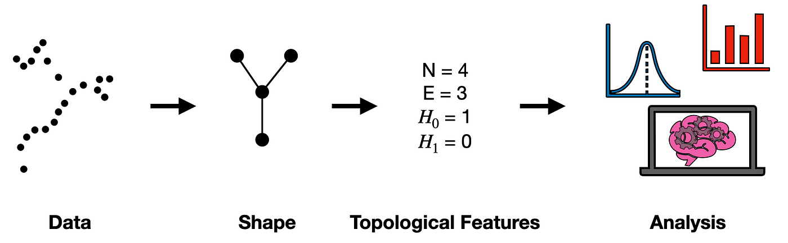
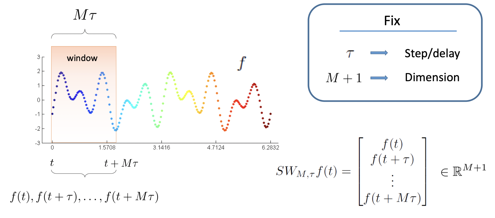
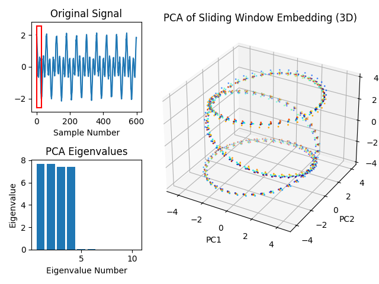
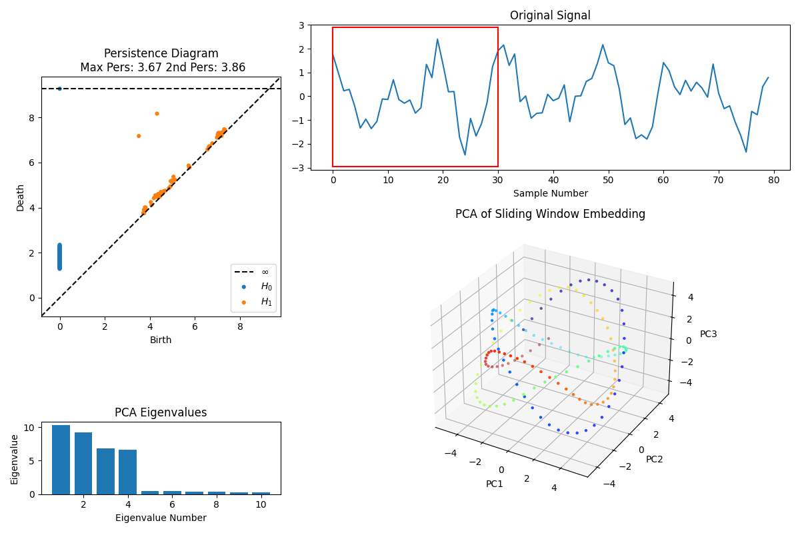
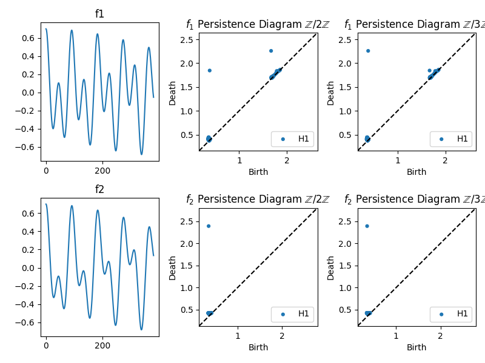
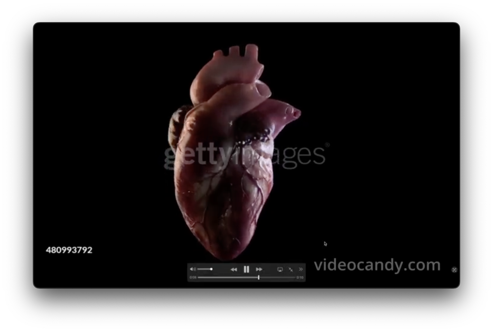
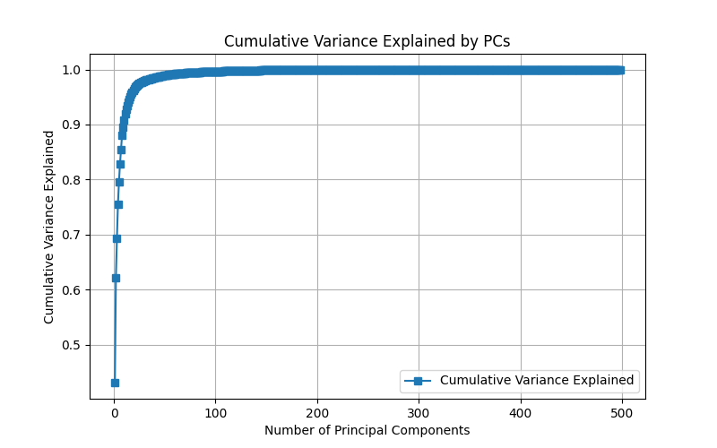
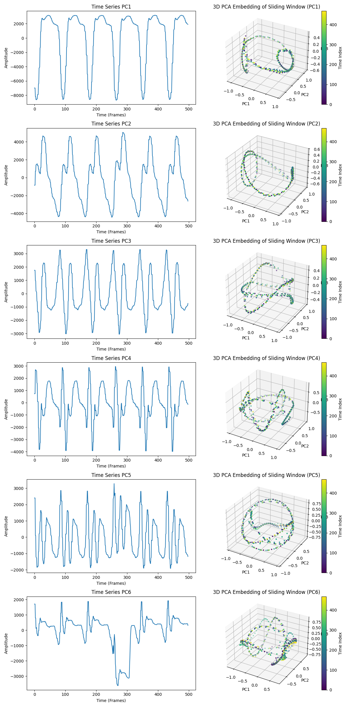
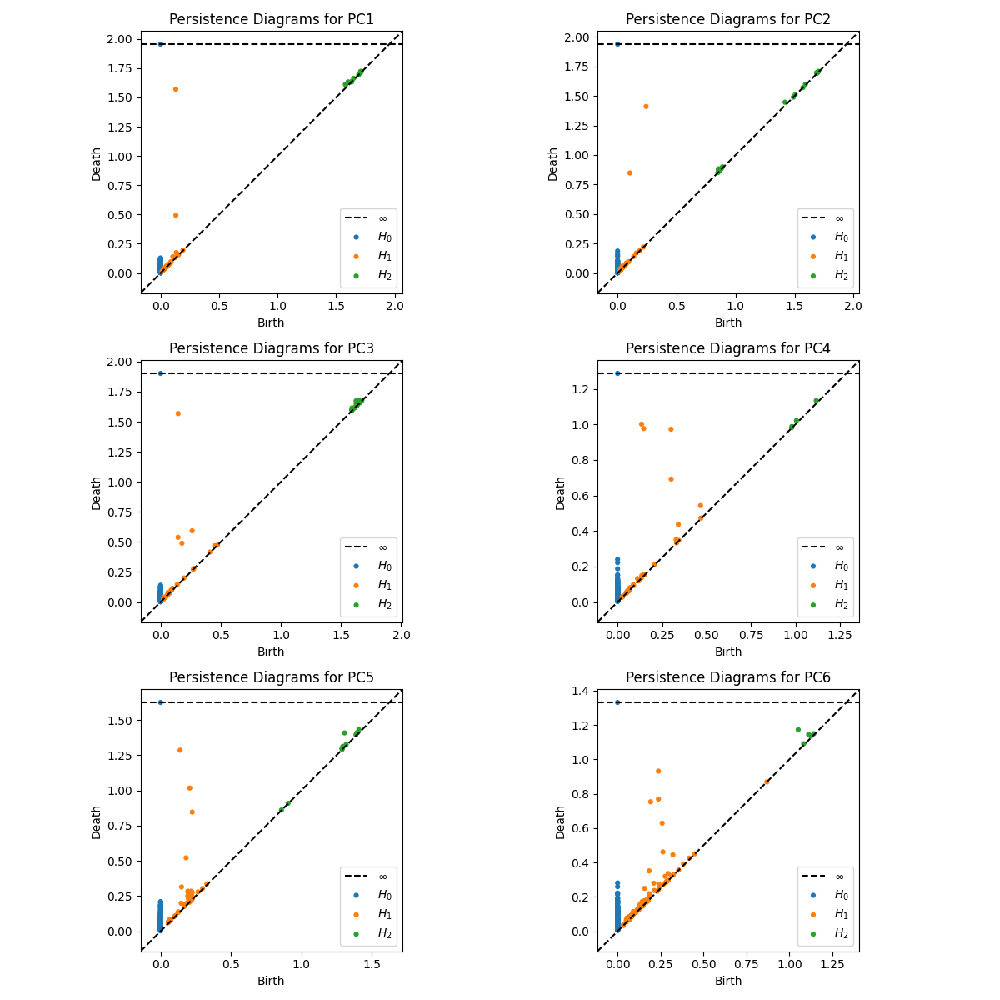

# Topological Data Analysis: Understanding the Shape of Data

  
  Image credit: https://www.youtube.com/watch?v=fpL5fMmJHqk

## 1. Introduction

- **Purpose of the Project**
  - The main goal of this project is to introduce the user (and me, when I started it) to the tools of topological data analysis. 
That requires some understanding of algebraic topology, and while we will 
try to cover some of the most relevant parts here, I refer the reader to the literature folder. 
  - One of my future goals is to be able to apply this overly complicated dimensionality reduction to 
many problems such as anomaly detection, optimization and symbolic regression. In terms of optimization
I believe that one would be able to reduce the complexity of a problem, and engineer relevant features, to a point where then
one could come up with a training sample that can be use in, e.g. deep neural networks, for training.  

- **Overview of Methods Used**
  - The key techniques used are:
    - Principal Component Analysis (PCA)
    - Sliding Window Embedding
    - Time Derivative Computation
    - Persistent Homology and Persistence Diagrams (That is the algebraic topology part!)
  - This set of methods provides us with an interesting framework to deal with times series. I am still exploring some of the 
  application but for now cyclic phenomena seems to be better fit. I am building here the application in examples that increase in complexity 
  and culminate in an example of video processing in the context of cardiology.
  - Remember that anything can be converted into a time series (if you are brave enough!).

- **References**
  - I am planning to upload a small document with more details on the mathematics behind
  the calculations we discuss here. I will only then organize the references. For now, for detailed
  references regarding the sources I used to create this code, the references for the mathematics behind
  and other fun and intriguing facts about algebraic topology, I refer the user to my presentation
  on the "literature" folder. 

## 2. Theoretical Background

  - **For more details on the mathematics behind this section, I refer the reader to 
my presentation on the literature's folder, and the references therewith!**

- **Principal Component Analysis (PCA)**
  - PCA is a widely used statistical technique in data science for 
  dimensionality reduction. It transforms a large set of correlated 
  variables into a smaller set of uncorrelated variables called principal
  components, without losing significant information from the original
  dataset. The main goal is to perform dimensionality reduction, by reducing the number of variables (
  dimensions) while preserving as much variability (information) as
  possible. The association between variability and information is key.
  - The process is as follows: We first perform as data standardization (mean-centered and scaled), 
  then we compute the Covariance Matrix (which tell us how the variables on our dataset relate to one another).
  We then perform an eigenvalue and eigenvectors decomposition, which allows to  then select the Principal Components (the Eigenvalues represent the amount of variance carried in each principal component, 
  and eigenvectors indicate the direction of the principal components in the feature 
  space, they are then ordered from highest to lowest Eigenvalue). 

  
  <figcaption style="text-align: center;">Figure 1: PCA of a multivariate 
   Gaussian distribution. The vectors shown are the eigenvectors of the covariance 
   matrix scaled by the square root of the corresponding eigenvalue, and shifted 
   so their tails are at the mean. By <a href="//commons.wikimedia.org/wiki/User:Nicoguaro" 
   title="User:Nicoguaro">Nicoguaro</a> - Own work, <a href="https://creativecommons.org/licenses/by/4.0" 
   title="Creative Commons Attribution 4.0">CC BY 4.0</a>, 
   <a href="https://commons.wikimedia.org/w/index.php?curid=46871195">
   Link</a></figcaption>

- **Time Series Analysis**
  - A time series is a sequence of data points collected or recorded at successive
  points in time, typically at uniform intervals. Each data point in a time series 
  represents the value of a variable at a specific time, capturing how that variable
  evolves over time. Time series data are ubiquitous and arise naturally in various 
  fields such as finance (stock prices, interest rates), meteorology (temperature, 
  rainfall measurements), economics (GDP, unemployment rates), engineering (sensor 
  readings), and many others. Interestingly enough, many other data objects can be converted
  a time series format. For instance, we could define any point in a grid as a point in a given space, 
  average the colour level to a RGB value between 0 and 1 (normalized to the 256 bits values), and
  plot that in "time" (time here being just a parameter to represent the direction we chose the 
  data to evolve with respect with.) That would allow us to apply the vast and wealth statistical 
  (and topological) methods used in conventional times series analysis.
  - An example that will be relevant later: A video is essentially a sequence of images (frames) displayed in rapid succession 
  to create the perception of motion over time. To convert a video into a time series,
  you extract quantitative data from each frame or a series of frames and represent 
  these data points as a sequence indexed by time. This transformation allows you to 
  analyze the temporal dynamics of the video’s content using time series analysis 
  techniques.

- **Sliding Window Embedding**
  - The sliding window technique is a method used to transform a one-dimensional (1D) 
time series into a higher-dimensional space by creating vectors composed of sequential
data points. This technique is fundamental in reconstructing the state space of a 
dynamical system, enabling the analysis of its underlying structure and dynamics when 
only a single observable (scalar time series) is available. In the future I want to extend that
to a correlated series of time series, that would allow us to capture the underlying phenomena
which express itself via different observables (times series TS1, TS2, etc...).
  - The key parameters are: 
    - Embedding Dimension ( `dim`  or  m ), which represents the number 
  of components in each embedding vector. It determines the dimensionality of the
  reconstructed phase space. A higher embedding dimension can capture more complex dynamics but
  may introduce noise if set too high.
    - Time Delay ( `Tau` ): Sets the lag between elements in each vector. It influences 
  the independence of vector components, like the autocorrelation function or mutual 
  information can identify an appropriate `Tau`.
    - Step Size ( `dT` ): Used to express how much the window slides forward
    between embeddings. Controls the density of points in the reconstructed space.
    A smaller  `dT`  (e.g., 1) provides finer resolution, while a larger `dT`  
    reduces computational load. In the present framework one can play around with these
    parameters values in order to understand how they affect the topological reconstruction
    of the time series. 

  - The transformation into higher-dimensional space is given by applying the sliding window embedding 
from the original time series  `x_t` , a sequence of scalar values to a set of vectors  `X_i`
in  m-dimensional space. This transformation allows for the plotting of the 
reconstructed trajectory to observe patterns like attractors. By applying
multivariate analysis techniques to study the system’s dynamics, we can use 
the reconstructed space for forecasting future states and categorizing and modelling
current data.
  - Be aware that sufficient length of the time series is needed to construct meaningful
embeddings. This approach works best with cyclical phenomena, but I believe one could express the data
in a way as to expose patterns in a categorizable way.

  
  Figure 2: reference: https://bit.ly/3easx09

- **Time Derivative Computation**
  - In the analysis of time series and dynamical systems, understanding how a system 
  evolves over time is crucial. The time derivative of a variable provides a quantitative 
  measure of its rate of change at each point in time. By computing the derivative, we can 
  highlight dynamic behavior, making it easier to identify periods of acceleration, 
  deceleration, or oscillatory behavior. Reveal underlying mechanisms, enhance feature 
  extraction (due to the fact that derivatives can serve as additional features in machine 
  learning models, improving the detection of patterns or anomalies that are not apparent 
  in the raw data.) It can also aid us with phase space reconstruction. When reconstructing
  the phase space of a dynamical system, both the variable and its derivative are often 
  needed to represent the system’s state fully.
  - In practice, time series data are recorded at discrete time intervals, which means we cannot 
  compute the derivative analytically. Instead, we approximate it using numerical methods. 
  The most common techniques involve finite difference approximations are:
    - Forward difference approximation, central difference approximation, or higher-order
    approximations. 
    - We need to bear in mind that Real-world data often contain noise, 
    which can be amplified when computing derivatives. To mitigate this, we can apply 
    a moving average filter to smooth out short-term fluctuations. One could also use filters 
    like the Butterworth filter to remove high-frequency noise, or convolve the data with a Gaussian 
    kernel for smoothing.
    - Another approaches involve Fitting a Curve (via Polynomial Fit or 
    Regression Models), or use a Savitzky-Golay filter, which is a popular method that 
    combines smoothing and differentiation

- **Topological Data Analysis (TDA)**
  - TDA is a field that applies principles from topology—a branch 
  of mathematics concerned with the properties of space that are preserved under continuous 
  transformations—to analyze and understand the shape and structure of data. TDA provides tools
  for extracting meaningful features from complex, high-dimensional datasets by examining their
  topological properties, such as connected components, holes, and voids.
  - Traditional data analysis methods often focus on statistical properties or geometric 
  relationships within data. However, these methods may overlook the global structural 
  features that can be crucial for understanding the underlying phenomena. TDA addresses 
  this limitation by:
    - Capturing Global Structure: TDA examines the overall shape of the data,
  identifying features that persist across multiple scales. 
    - Robustness to Noise: Topological 
  features are inherently stable under perturbations, making TDA effective in noisy datasets.
    - Dimensionality Reduction:TDA can extract essential features from high-dimensional data 
  without significant loss of information. 
    - Flexibility Across Domains: Applicable to various types of data, including point clouds, images, and time series.

  

 Figure 3: TDA pipeline applied to a time series using PCA and a sliding window embedding to extract patterns in TS data.

- **Persistence Homology**
  - Persistent homology is one of the central concepts in TDA. It is a method used to 
  compute and analyze the multi-scale topological features of a dataset. Persistent 
  homology tracks how these features appear and disappear as we examine the data at 
  different scales, allowing us to identify which features are significant and which
  are likely due to noise. Some basic concepts are:
    - Simplical Complexes: A collection of simplices (points, line segments, triangles, 
    and their higher-dimensional counterparts) that are combined in a way that generalizes 
    the notion of a network or mesh. They provide a way to construct a topological space 
    from discrete data points.
    - Filtration: A nested sequence of simplicial complexes, each built at a different 
    scale parameter. By varying the scale, we capture the evolution of topological 
    features in the data.
    - Homology (cf. Betti numbers): A mathematical concept that quantifies the topological features of a 
    space, such as connected components, holes, and voids.
      - 0-dimensional (H₀): Counts connected components. 
      - 1-dimensional (H₁): Counts loops or holes. 
      - 2-dimensional (H₂): Counts voids or cavities in 3D spaces 
      - Homology groups summarize the topological features at each dimension.
  - How Persistent Homology Captures Topological Features Across Scales?
    - Given a set of data points in a metric space (e.g., ℝⁿ), we begin by constructing 
    simplicial complexes to represent the data’s structure. Two possibilities are worth 
    mentioning: Vietoris-Rips Complex, where we connect all pairs of points within a distance ε, 
    forming simplices from these connections. Another one is a Čech Complex, in which case we 
    Consider overlaps of balls centered at data points with radius ε.
    
  - As ε increases, the simplicial complex grows, and new topological features emerge or merge. 
  Start with ε = 0: Each data point is a separate connected component. Increment ε: Points 
  within ε distance are connected, forming edges and higher-dimensional simplices, further 
  increase in ε leads to features like connected components that merge and loops form or fill in.

- Tracking Features with Birth and Death Times:
  - Birth Time: The scale ε at which a topological feature appears.
  - Death Time: The scale ε at which the feature disappears (e.g., when a loop fills in).
  - Persistence: The difference between death and birth times. Features that persist over a wide range of scales are considered significant.

- A persistence diagram is then a plot of points where each point represents a feature, with
the x-coordinate as the birth time and the y-coordinate as the death time: Points far from 
the diagonal (birth = death) represent persistent features, and persistence barcodes represent 
a collection of horizontal line segments (bars), each representing a feature’s lifespan 
over scales.

- In this context, persistent features indicate the true underlying structure in the data, 
as opposed to ephemeral features, which are likely due to noise or sampling artifacts. 
H₀ (Connected Components) are clusters or separate groups in the data. H₁ (Loops/Holes) 
are cyclical structures or voids in 2D data. H₂ (Voids) are the cavities in 3D data. 
The example can be extended to higher dimensions at the cost of human capability to
visualisation and computer memory usage. Those could, nonetheless, still be valid for a
more accurate machine learning training process

  

 Figure 4: The persistence diagram (top left) plots the “birth” and “death” 
times of topological features extracted from the data at different
scales. H_0  features (blue dots) correspond to connected components, and  H_1  
features (orange dots) represent loops or circular structures. The larger persistence values indicate more 
prominent topological features that persist across scales, while features close to the 
diagonal represent noise. The two largest persistence values (Max Pers: 3.67, 2nd Pers: 3.86) 
suggest significant cyclical structures within the data.

## 3. Code Details

- **Data**
  - Basic point cloud points are generated under `point_cloud.py`. A lot of the time series data is g
  generated by a series of sines and cosines with noise. The most significant
  functions inside `time_series.py` are properly commented and detail on the mathematics
  behind the calculations will be published later on arxiv. For now, I refer the reader
  to the literature folder. The Video data requires a more nuanced explanation and that is given below. 
  - Each of the computations required a different type of data generation, and therefore
  has its own function within the class `TimeSeries` in order to handle their idiosyncrasies.
  The user is invited to play around wit the data generation to explore more the topological properties
  of times series not discussed here. 

- **Performing PCA**
  - The PCA is performed under the `time_series.py` and for each data tipe, a specific 
  function is created. Significant functions are well commented, I also refer the reader
  to read the docs of the PCA function of `sklearn.decomposition` for further details.

- **Sliding Window Embedding**
  - A sliding window embedding is a technique used in time series analysis and machine learning
  where a “window” of fixed length moves across the data, capturing a subset of values at each 
  step. This window “slides” over the data with a specified overlap or shift (stride), creating
  multiple overlapping segments. Each segment, or “embedding,” represents the local behavior of 
  the data within the window, allowing algorithms to capture temporal patterns and contextual information.
  - Parameters such as `dim`, `Tau`, `dT` are used throughout this code, together, they control the time resolution, depth, 
  and movement of the embeddings across the data, helping to capture temporal dependencies and patterns 
  in a structured way. Here is a brief explanation 
  of their impact on the analysis:
  - `dim`: This parameter sets the number of past points (or time steps) that each embedding will capture. In other words, dim defines the “dimension” or length of each embedded vector.
  - `Tau`: This is the delay or spacing between each point within a single embedded vector. For instance, if Tau = 2 and dim = 3, each embedding will capture every second point over a span of six time steps. Tau helps introduce temporal separation within the embedded points, which can reveal periodic patterns or longer-term dependencies in the data.
  - `dT`: This parameter determines the step size of the sliding window as it moves through the data. A smaller dT means the window slides forward by only a small amount, leading to more overlapping windows, while a larger dT results in fewer windows with less overlap. Choosing dT appropriately balances the resolution of temporal features and the computational cost.
  

- **Extracting Time Series from Video**
  - After performing PCA on the video frames, each principal component (PC) represents a direction of maximum variance in the data. By projecting the frames onto these PCs, we obtain time series that show how each PC’s influence varies over time. Specifically, the time series for PC1, PC2, and PC3 are extracted by taking the coefficients corresponding to these components across all frames.
  - PC1 captures the most significant variance in the data, often corresponding to the most prominent patterns or motions in the video. PC2 and PC3 capture the next levels of variance, representing secondary patterns. Analyzing these PCs allows us to focus on the most influential dynamics in the data while ignoring less significant variations.

- **Computing the Time Derivative**
  - The time derivative is computed by taking the difference between consecutive values in the PCA-transformed time series. This highlights changes over time, emphasizing dynamic transitions. The derivative helps in capturing the system’s behavior more accurately by focusing on changes rather than static values.
  - To mitigate the effects of noise, smoothing techniques like moving averages or Gaussian filters may be applied to the time series before or after differentiation. This reduces high-frequency noise that can obscure meaningful patterns, ensuring that the analysis focuses on significant trends.

- **Performing PCA on Embedded Data**
  - After performing sliding window embedding on the time series, we obtain high-dimensional data representing temporal dynamics. Applying PCA to this embedded data reduces its dimensionality by identifying the principal components that capture the most variance. This step simplifies the data while preserving essential patterns for visualization and analysis.
  - By reducing the data to 2 or 3 principal components, we make it feasible to visualize complex temporal patterns in scatter plots. Dimensionality reduction also helps in removing redundant or less informative features, allowing computational methods like persistent homology to focus on the most significant structures in the data.

- **Computing Persistence Diagrams from PCA-Transformed Embeddings**
  - Persistence diagrams are computed from the PCA-transformed embeddings using persistent homology, which identifies topological features like connected components, loops, and voids at various scales. The diagrams plot the birth and death times of these features, providing insights into the data’s intrinsic geometric and topological structure.
  - The Ripser library is utilized for efficient computation of persistent homology on high-dimensional data. It allows us to compute persistence diagrams quickly, even for large datasets, making it practical to apply topological data analysis methods in our project.

- **Visualization**
	- Time Series Plots of Principal Components:
	  - These plots display how each selected PC varies over time, highlighting patterns, trends, or periodicities in the data.
	- Scatter Plots of PCA Embeddings:
      - plotting the first two or three principal components of the embedded data, we visualize the temporal dynamics and uncover structures like clusters or trajectories.
	- Persistence Diagrams for each PC:
	  - These diagrams illustrate the topological features present in the data, showing the lifespan of homological features across different scales.

- **Interpretation of visualizations**
   - Time Series Plots:
	  - Peaks and troughs indicate significant changes or events in the data. Regular patterns suggest periodic behavior, while irregularities may indicate noise or complex dynamics.
   - Scatter Plots of PCA Embeddings:
      - The shape and distribution of points reveal the underlying structure of the time series. Loops might indicate cyclical behavior, while clusters could signify stable states.
   - Persistence Diagrams:
      - Points far from the diagonal represent persistent features, which are significant topological structures in the data. The number and lifespan of these features help in understanding the complexity and nature of the underlying system.

## 4. Explanation of Computations

- **Cosine Signal**
  - Generates a cosine function and applies sliding window embedding and PCA on it.
  - This part of the code is meant to serve as an introduction on how the many parameters we use play a role on the final topological analysis of the time series.

- **Non-Cyclical TS**
  - Similar structure as above, but on a non-cyclical time series.
  - Observe here the relationship (or lack thereof) between an almost non-cyclical time series and the topological structure. 

- **Cyclical TS**
  - Similar structure as above, but on a cyclical time series.
  - Observe how the 3D Embedding already demonstrate a structure that captures a feature of the time series.
  - Play around with the parameters and observe how that affect the 3D structure. 

- **TS-PCA-TD**
  - Here we further improve the analysis above by adding the computation of the Persistence Diagram (PD). 
  - I refer the reader to the images folder, where you will find an image with a summary of the Betti numbers for the different topological objects. 
  

- **TS-PCA-Embedding-TD**
  - In this example we observe a full analysis. The original signal is plotted, together with the PCA Eigenvalues and the 
  PCA of Sliding Window Embedding. 
  - Finally, the PD helps us to categorize the topological structure. In the case with 
  the parameters chosen as suggested in the prompt, the Betti numbers are (1,2), which are equivalent to two rings connected. 
  

- **Field of Coefficients**
  - In topology, we use algebraic structures called homology groups to study the shape and features of spaces. These groups capture information about holes of different dimensions in a space (like connected components, loops, voids).
  - A chain is a formal sum of simplices (like points, edges, triangles) in a space, which are sequences of groups connected by boundary operators.
 	The coefficients in these sums come from a mathematical structure called a field or a ring. 
    Common choices for coefficients are integers (Z), integers modulo a prime number (Z/pZ), or real numbers (R). Using those coefficient simplifies the calculation. 
  - In fields, every non-zero element has a multiplicative inverse, making algebraic operations straightforward.
  The choice of coefficients affects the resulting homology groups. Some features may be detected or missed depending on the coefficients used.
  - Computing homology over different fields may reveal different topological features.
  For example, torsion elements (elements of finite order) in homology groups may only be detected with integer coefficients.
  - Think of computing homology with different coefficients like tuning a radio to different frequencies. 
    - Using Z coefficients: You pick up all the signals (including subtle ones), but the noise (complexity) is higher.
    - Using  Z/2Z coefficients: You simplify the reception, focusing on the strongest signals, but might miss some nuances. 

  - An example of TDA ona  field of coefficients: 
    - We are going to generate two signals f1 and f2 and analyse how their topological structure change
    when we look at their persistence diagram over a field of coefficients, Z/2Z and Z/3Z:

 

 Figure 5: Two different time series signals, 
f1  and  f2. The different coefficients
cause slight variations in the embedding patterns, but both show 
a continuous path through 3D space, highlighting the cyclical.

- **PCA on Video - Throat**
  - The computation of this option is similar to the one below, although simpler. I refer the reader
  to the explanation below for a more detail explanation of the topological analysis of video data. 

- **PCA on Video - Heart**
  - **Objective**
    - Analyze a heart beat video using PCA, sliding window embedding, and TDA. I believe that one would
    be able to apply this method to categorize heart conditions in more detail. Since issues in different
    parts of the heart tissue would manifest themselves in very specific ways on the heart movement, maybe that would only be
    perceived in Principal Component 5, or, 6 or, 7. 
  - **Steps Involved**
    - Loading and preprocessing video data.
    - Performing PCA on video frames.
    - Extracting and analyzing multiple principal components.
    - Computing the time derivative of PCA-transformed data.
    - Applying sliding window embedding to time series.
    - Performing PCA on embedded data.
    - Computing and plotting persistence diagrams.
  - **Parameters options**
    - `n_components`, `dim`, `Tau`, and `dT`. All given.
  - **Results and Interpretation**
    - Summarize findings from the persistence diagrams and embeddings.
    - Highlight any significant patterns or topological features discovered.
    - Check out the results on Appendix A.

## 5. Discussion

- **Insights Gained**
  - I hope that after delving on this code, the user/reader/learner was able to gain a better insight on topological data analysis, just 
  like I was able to, by developing it. There is an insurmountable amount of things to improve, but life is short. 

- **Challenges Faced**
  - There is a series of optimization that can be made in order to optimize the code for memory usage. At first
  that was definitely not my priority, but I am open to suggestions.

## 6. Conclusion

- **Summary of Work**
  - My main intettion with this project is to provide an esy to install and easy to contribute framework for introduction to topological data analsysis.
    A lot is still needed to bring this project to the standrs of what already exists (both from the references I used and beyond).  

- **Future Work**
  - A lot of the future work is summarized in `to_do_next.txt`. A personally interesting pair of goals would be to be able to apply this approach in
    modelling of separated-scale phenomena, and dimensionality reduction for a more effective machine learning training. 

## 7. References

- **Literature Used**
  - Academic papers, textbooks, or articles used here can be found on the `literature` folder. 
  More specifically, on the pdf presentation I gave at the University of Bochum. 
  - Hopefully soon I am going to have time to write up a decent version of the explanation of the code. 

- **Software and Libraries**
  - Cf. `requirements.txt`

## 8. Appendices

- **Appendix A: Some Plots**

Shown here our heart example: I have used a dummy video of a heart video I downloaded and compressed. 
Details about the computation can be found on Section 4 of the present document. 

  

  Figure 6: Screen shot of  the video used for the TDA of a heart beating. Credit: Getty Images.

After the analysis, we are given a cumulative variance analysis plot, to understand how many principal 
components are needed in order to capture the variance (information) of the data.

  

  Figure 7:  Cumulative variance 
explained by each principal component, highlighting how much of
the data’s variability is captured as more principal components 
are added. More PCs add to variability, but increase computational cost and could
be just a result of noise.

We then proceed with the plotting of the heart PCA embedding. Here, each row in
the figure represents a time series from one of the first six principal components (PC1 through PC6) 
extracted from the original data. Each corresponding 3D plot shows the sliding window embedding 
of the time series for each principal component.

  

  Figure 8: The cyclic and toroidal 
shapes in each embedding indicate that each principal component 
retains some periodic or oscillatory structure. The closed or looping 
structures suggest recurring patterns that may represent regular heart 
cycles or beats.

Last, we perform the persistence diagram analysis of the processed data.
Each plot in the figure below shows a persistence diagram for one of the 
principal components (PC1 to PC6), which helps quantify the topological
features in each component. I imagine that this separation of the data into the PCs, and
the PD analysis on each of the PCs would help us to better investigate what
components of the data are anomalous (as we see in TS PC6 above), and help us to 
better model different phenomena. 

As you can see, the anomalous behaviour on the TS PC6 happens around frames 250 and 330. Since 500
frames represent the whole 9 seconds, at 55 frames per second, 250/55 equals to more or less 4,5s, and
330/55 equals 6s. 

In our video, the play/pause bar disappears between the seconds 4 and 6, which would
then explain the drop. But notice that it only manifest itself on the 6th principal component.
That means that, if we wanted to train a deep neural network with this video, only
a few PCs would be needed, that would reduce the size of the training set. In case
of modelling the heart beat, the same could be done, but instead of looking at the
whole video, we would try to model only the TSs of PCs 1 to 4 or 5, reducing the training size. 
From another direction, would could focus only on analyzing only PCs 6 to 7 or 8 in order to 
understand anomalous behaviour that only manisfest itself on rapid and/or small scales. 

  

  Figure 9: The diagrams identify 
significant topological features in each principal component’s time 
series, using three types of homology classes. H0: Connected 
components (shown as blue dots), representing clusters or isolated 
components. H1: Loops (orange dots), indicating cyclic structures.
H2: Voids or higher-dimensional holes (green dots), which may 
suggest more complex multi-dimensional features.

The persistence diagrams for the first few components show more prominent features,
especially in  H1  (orange points), indicating strong cyclic structures in these 
components. The presence of higher-dimensional features (green points for  H2 ) 
in some components suggests additional layers of structure or periodicity in the data, 
potentially corresponding to more complex physiological signals. Notice that we
use a low resolution (compressed), print screen of a video simulation. Ideally one would
need a much better quality data in order to make sure the PDs are meaningful. 

Ideally, I believe one could apply this methodology in order to detect patterns in data,
and once those patterns are categorized, they could be used to train deep learning models, 
or they could also be used as source for symbolic regression, in which case we could come
up with an analytical modelling of the behaviours of the main principal components. 

- **Appendix B: Some Code Snippets**

## 9. License

This project is licensed under the MIT License. If you would like to contribute, use, cite, criticise
please contact me at felipennathan at gmail. 

---
